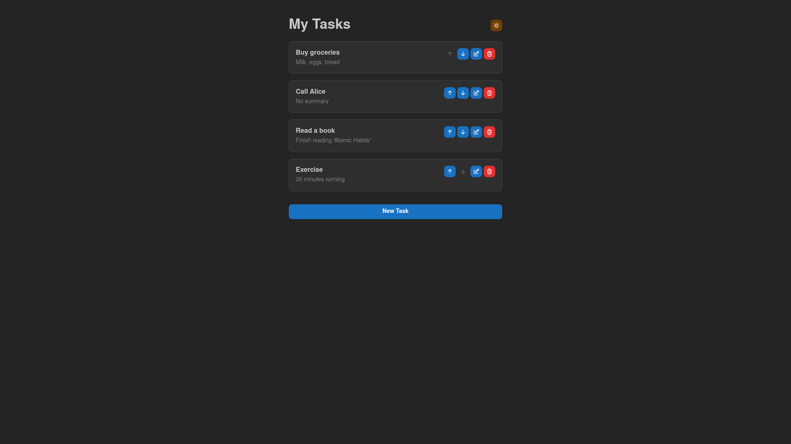

# TODO List

A modern React todo list built with **Mantine UI** that supports adding, editing, deleting, and reordering tasks. Features a **REST API backend** for persistent storage, **custom hooks** for clean code architecture, and **dark/light theme** support.

---

## Screenshot



---

## Features

- Add new tasks with title and description
- Edit existing tasks
- Delete tasks
- Move tasks up and down
- Dark/light theme toggle
- REST API integration for persistent backend storage
- Custom hooks for state management (`useTasks`, `useModal`, `useLocalStorage`)
- Optimistic updates for better UX

---

## Getting Started

### 1. Clone the repository

```bash
git clone https://github.com/KnightParzivalll/ReactSimpleTODOList.git
cd ReactSimpleTODOList
```

### 2. Install dependencies

```bash
npm install
```

### 3. Start the development server

```bash
npm run dev
```

The app will be available at `http://localhost:5173`

---

## Architecture

### Project Structure

```
src/
├── components/
│   ├── Header.tsx
│   ├── TaskList.tsx
│   ├── TaskCard.tsx
│   ├── TaskFormModal.tsx
│   └── ThemeToggle.tsx
├── hooks/
│   ├── useTasks.ts      # Task API calls
│   ├── useModal.ts      # Modal state management
│   └── useLocalStorage.ts
├── services/
│   └── api.ts        # API integration
├── types/
│   └── task.ts
├── App.tsx
└── main.tsx
```

### Custom Hooks

- **`useTasks`**: Manages task state, API calls, and error handling. Provides methods for CRUD operations with optimistic updates.
- **`useModal`**: Handles modal state for creating and editing tasks, including form data management.
- **`useLocalStorage`**: Utility hook for local storage integration (for theme persistence).

### API Integration

The app connects to a REST API for all data operations:

- **Base URL**: `https://faithful-peace-production-595d.up.railway.app`
- **GET** `/todos/` - Fetch all tasks
- **POST** `/todos/` - Create a new task
- **PATCH** `/todos/{id}` - Update a task
- **DELETE** `/todos/{id}` - Delete a task
- **POST** `/todos/{id}/move-up` - Move task up
- **POST** `/todos/{id}/move-down` - Move task down

---
